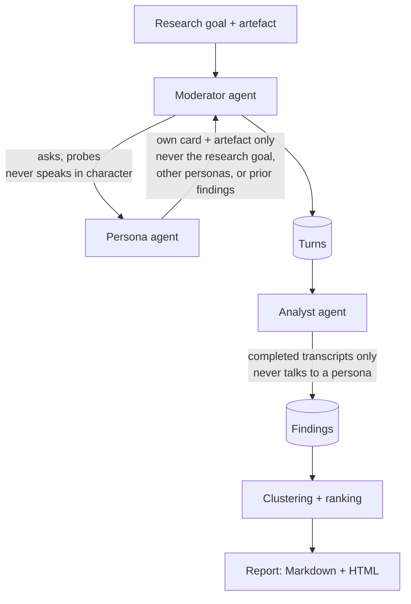

# Synthetic User Lab

A research harness that runs a panel of LLM-simulated users against a product
artefact (a landing page, an onboarding flow, a pricing table) and produces a
structured, reproducible research report: findings ranked by severity and
frequency, broken down by user segment, with every claim traceable to a
transcript. Three role-isolated sub-agents do the work — a Moderator that
knows the research goal and asks the questions, a Persona that knows only its
own character card and the artefact, and an Analyst that sees completed
transcripts and extracts structured findings — because a persona that can see
the research question answers the research question instead of behaving like
a user. **This does not replace real user research.** It's a cheap, fast,
reproducible way to generate hypotheses and catch obvious problems before
spending real participants' time, and this README's job is to be explicit
about where that holds.

## Measured limits (read this before the demo)

These numbers come from `docs/validity_report.md`, produced by `sul validate`
against a cassette-backed recording of `anthropic/claude-sonnet-5` (Analyst)
and `anthropic/claude-haiku-4-5` (persona, moderator, probes) — call it
**Config A**. **Four of the five checks below come from that one
configuration.** A second configuration — Haiku as the Analyst too ("Config
B") — was recorded and compared against discriminative validity specifically:
see the Claim-trace row below for what held and what changed. That comparison
covers one panel, one seed, one artefact pair, and doesn't extend past
discriminative validity to the other three checks, or past this one Analyst
swap to cheaper or different model combinations generally.

| Check | Result | Denominator |
|---|---|---|
| Acquiescence bias | **gap 1.0** — positive-framing agree rate 0.0, negative-framing agree rate 1.0 | 5/5 subjects |
| Known-answer calibration | **1/3** defects detected | 3 seeded defects |
| Discriminative validity | **6** blocker/confusion findings (bad artefact) vs **0** (good artefact) | 5 personas per artefact |
| Position bias | **shift 0.0** | 5/5 subjects |
| Reproducibility | variance 0.0, mean top-5 Jaccard 1.0 | 3 repeats |

The acquiescence result is the most serious limitation of the whole approach:
**the panel agreed with whatever framing it was given, every single time, in
both directions.** A positively-framed question ("Was the pricing clear?")
got agreement 0/5. The negatively-framed version of the same question ("Was
anything unclear about the pricing?") also got agreement 5/5 — not "no", but
the same shape of agreement pointed the other way. That is not evidence the
panel forms an opinion about pricing clarity at all.

The reproducibility row is **structurally, not empirically, zero**: it always
runs against `FakeProvider`, whose same-seed output is deterministic by
construction (`sul.validity.model.REPRODUCIBILITY_CAVEAT`), so 0.0 variance
here measures the harness's own determinism, not the panel's. A live,
uncassetted run against a real provider could show non-zero variance — that
would be expected, not a failure — but this harness has never performed one.

Full detail, including three offline-measurable clustering weaknesses
(cluster themes partly reflect the Analyst's writing style; a rare theme and
a broken TF-IDF vectorisation look identical in every rendered report; a
fixed clustering threshold is unmeasured territory as studies scale past the
sizes tested here): **[`docs/limitations.md`](docs/limitations.md)**. The raw
per-check numbers and provenance: **[`docs/validity_report.md`](docs/validity_report.md)**.

## Architecture



Every agent call goes through one provider abstraction
(`sul.providers.base.LLMProvider`) and records a `ModelCall` row — cost,
tokens, latency, and which agent made the call. A repaired structured-output
call (one malformed response, one retry) writes **two** `ModelCall` rows, not
one, so the audit trail shows the repair happened
(`tests/test_structured_output.py::test_repair_turn_can_succeed`).

Persona isolation is enforced in code, not just prompt wording:
`Persona.panel` and `Panel.study` are mapped `lazy="raise"`, so any code path
that tries to walk from a persona up to its study's research goal raises
immediately instead of silently lazy-loading
(`tests/test_isolation.py::test_persona_panel_relationship_raises_on_lazy_load`).
The object assembled into a persona's own input is built from nothing but its
card text, the artefact, and its own prior turns
(`tests/test_isolation.py::test_persona_context_never_leaks_sentinels`).

Full entity-relationship diagram and the persona-sampling pipeline:
**[`docs/architecture.md`](docs/architecture.md)**.

## 60-second demo

No API key needed — everything below runs against `FakeProvider`.

```powershell
.\make.ps1 install    # uv sync + pre-commit hooks
.\make.ps1 demo        # runs a complete study end to end, verifies the result
.\make.ps1 validate    # runs the M6 validity harness, writes the two docs above
uv run sul dashboard    # serves the read-only dashboard at http://127.0.0.1:8000
```

`sul dashboard` needs its own terminal (it serves until killed); visit
`http://127.0.0.1:8000` for the study list → run list → transcript view →
report view. Every page — including every HTMX partial — carries the
standing caveat in the section below, and no swap this app declares can hide
it (`tests/test_web_caveat.py`).

**Docker workflow:** `docker compose up -d` builds and starts the read-only
dashboard, bind-mounting the repo root read-only so it can see whatever
`sul.db` the host produces; `.\make.ps1 demo` then runs on the **host**, not
inside the container (§M7's acceptance chain names `docker compose up`
*before* `make demo` on purpose). Reload `http://127.0.0.1:8000/` and the
study just materialised shows up, no API key set anywhere. The image ships no
`tests/cassettes/`, so it cannot run `sul validate` in-container — that would
silently fall back to `FakeProvider` rather than replay Config A
(`sul.cli._select_validate_provider`); the container's job is the dashboard
plus `sul demo`, both of which need no cassette. `Dockerfile`,
`docker-compose.yml`, and `.dockerignore` are all committed at the repo root;
`PROJECT_SPEC.md` §M7 records what proved this and its deviations.

## What this simulated panel is, on every page

> This report was generated by a panel of LLM-simulated personas, not real users. Every quote below is model output produced in character, not something a person said. Treat findings here as hypotheses to validate with real participants, not as user research on their own.

## Cost

Nothing in this project has ever run a 40-persona study — the largest real
study recorded is 5 personas. The table below is an **extrapolation**, not a
measurement: it scales the real, cassette-backed 5-persona discriminative
validity run 8× and prices it through `sul.pricing.cost_for` against the
committed `configs/pricing.yaml` rate card, not a hand-typed number.

**Measured basis — 5 personas, bad-onboarding artefact, Config A:**

| Agent | Model | Calls | Tokens in / out | Cost |
|---|---|---|---|---|
| Analyst | `claude-sonnet-5` | 5 | 6,254 / 842 | $0.031392 |
| Moderator | `claude-haiku-4-5` | 3 | 2,239 / 114 | $0.002809 |
| Persona | `claude-haiku-4-5` | 8 | 13,740 / 953 | $0.018505 |
| **Total** | | **16** | | **$0.052706** |

**Extrapolated to 40 personas (×8, unverified projection):** roughly **$0.42**
per study on this provider mix. The weak step in this projection is that it
assumes every agent's call count scales linearly with persona count — the
Moderator and Analyst sides have never actually been run at 40 personas, so
whether they scale linearly is untested, not just unmeasured.

**Per provider:** `configs/pricing.yaml` prices Anthropic (`claude-opus-5`
$5.00/$25.00, `claude-sonnet-5` $3.00/$15.00, `claude-haiku-4-5` $1.00/$5.00,
all per MTok) and the zero-cost `fake`/`ScriptedProvider` tiers used by every
test. `openai` and `gemini` are **empty by design** — `sul.pricing.price_for`
raises `UnknownModelError` rather than silently billing $0.00 for an
unpriced model, and no authoritative current rate card for either has been
added yet, so "per provider" above means Anthropic plus the free simulated
tier. `sul cost <study_id>` prints the real, `ModelCall`-backed total for any
study actually run.

## What I'd do differently with real participants

- **Chase the acquiescence gap before trusting anything else the panel says
  about opinion or sentiment.** A 1.0 gap over 5/5 subjects means this panel,
  in its current form, cannot be used to ask a question and trust the
  direction of the answer — only whether it *notices something to say at
  all*, which is closer to what discriminative validity and known-answer
  calibration actually measure.
- **Recruit real participants for anything the panel flags with `severity`
  disagreement or a singleton cluster** — the zero-vector-conflation
  weakness in `docs/limitations.md` means a rendered report cannot tell a
  genuine rare finding from a clustering artefact, and only a human reading
  the transcript (or a real participant) can.
- **Still watch `sul run --provider anthropic` against a live, rate-limited
  provider for real stakes** — a run that fails on `RateLimited` exhausted,
  `Refused`, `BadRequest`, `Overloaded`, or a raw connection error is now
  caught and marked `FAILED` per-run (`sul.runner.orchestrator
  ._run_one_persona`, PROJECT_SPEC.md Deviation 17), not left stuck, but a
  study-wide fatal like a bad API key now surfaces as one `FAILED` row per
  persona instead of one crash — read `StudyRunSummary.failed`, don't assume
  `run_study` raising is still the signal for "the whole study is unusable."

## Claim-trace

Every capability claim above is exactly one of: **Measured** (a harness
number, cited with its denominator), **Structural** (code plus a test that
fails if the property is removed), **Demonstrated** (a command you can run),
or **Unverified** (stated as such, never silently implied).

| Claim | Category | Evidence |
|---|---|---|
| Acquiescence gap 1.0 (5/5) | Measured | `docs/validity_report.md` §3 |
| Known-answer calibration 1/3 (5/5 bad-artefact personas) | Measured | `docs/validity_report.md` §5 |
| Discriminative validity 6 vs 0 over 5/5 personas per artefact | Measured | `docs/validity_report.md` §2 |
| Position bias shift 0.0 (5/5) | Measured | `docs/validity_report.md` §4 |
| Swapping the Analyst from Sonnet to Haiku (Config B) leaves the bad-artefact blocker/confusion aggregate and material-difference verdict unchanged (6 vs 0 either way) but not its composition: 0 `blocker` findings vs Sonnet's 1, 2 distinct evidence anchors vs Sonnet's 5, lower severities, at roughly a quarter the Analyst spend — one panel, one seed, one artefact pair, not a general property of either model | Measured | `tests/test_validity_cassette_report_determinism.py::test_config_b_numbers_are_reproducible_and_complete` |
| Reproducibility variance 0.0 (structural, not empirical) | Measured + caveated | `docs/validity_report.md` §1, `REPRODUCIBILITY_CAVEAT` |
| Persona never sees research goal | Structural | `tests/test_isolation.py::test_persona_panel_relationship_raises_on_lazy_load`, `::test_persona_context_never_leaks_sentinels` |
| A repaired call writes two `ModelCall` rows | Structural | `tests/test_structured_output.py::test_repair_turn_can_succeed` |
| Standing caveat survives every HTMX swap | Structural | `tests/test_web_caveat.py::test_caveat_element_is_never_inside_an_htmx_swap_target` |
| A persona run failing on `Overloaded`/`RateLimited`/`Refused`/`BadRequest`/a connection error is marked `FAILED` with a recorded error, never left stuck `RUNNING`, and sibling personas are unaffected | Structural | `tests/test_orchestrator_provider_error_containment.py::test_a_provider_error_other_than_budget_marks_the_run_failed` |
| No test hits a real LLM API | Structural | session-scoped socket guard, `tests/conftest.py` |
| 40-persona study cost | Unverified (extrapolation) | scaled ×8 from the measured 5-persona table above |
| `openai`/`gemini` cost tiers | Unverified (no rate card) | `configs/pricing.yaml` — sections deliberately empty |
| §M7 Docker packaging (`docker compose up` → `make demo` → dashboard, no API key) | Demonstrated | `PROJECT_SPEC.md` §M7 note, recorded MET; `Dockerfile`, `docker-compose.yml`, `.dockerignore` |
| 60-second demo runs offline, no API key | Demonstrated | `.\make.ps1 install && .\make.ps1 demo && .\make.ps1 validate` |
| Full test suite runs offline, zero spend | Demonstrated | `.\make.ps1 test` |
