# Architecture

## Entity-relationship diagram

```mermaid
erDiagram
    ARTEFACTS {
        INTEGER id PK
        VARCHAR name
        VARCHAR kind
        VARCHAR content_hash UK
        TEXT body
    }
    FINDINGS {
        INTEGER id PK
        INTEGER run_id FK
        VARCHAR category
        INTEGER severity
        TEXT summary
        INTEGER evidence_turn_id FK
        INTEGER cluster_id
    }
    MODEL_CALLS {
        INTEGER id PK
        INTEGER run_id FK
        VARCHAR agent
        VARCHAR provider
        VARCHAR model
        VARCHAR prompt_hash
        INTEGER tokens_in
        INTEGER tokens_out
        FLOAT cost_usd
        INTEGER latency_ms
        INTEGER seed
        BOOLEAN cached
        DATETIME created_at
    }
    PANELS {
        INTEGER id PK
        INTEGER study_id FK
        INTEGER seed
        INTEGER size
        TEXT config_yaml
    }
    PERSONAS {
        INTEGER id PK
        INTEGER panel_id FK
        VARCHAR name
        VARCHAR segment
        JSON attributes
        TEXT card_text
    }
    RUNS {
        INTEGER id PK
        INTEGER study_id FK
        INTEGER persona_id FK
        INTEGER scenario_id FK
        VARCHAR status
        DATETIME started_at
        DATETIME finished_at
        TEXT error
    }
    SCENARIOS {
        INTEGER id PK
        INTEGER study_id FK
        TEXT task
        JSON questions
    }
    STUDIES {
        INTEGER id PK
        VARCHAR name
        TEXT research_goal
        INTEGER artefact_id FK
        VARCHAR config_hash
        VARCHAR git_sha
        DATETIME created_at
    }
    TURNS {
        INTEGER id PK
        INTEGER run_id FK
        VARCHAR role
        INTEGER ordinal
        TEXT content
        INTEGER model_call_id FK
    }
    RUNS ||--o{ FINDINGS : "run_id"
    TURNS ||--o{ FINDINGS : "evidence_turn_id"
    RUNS |o--o{ MODEL_CALLS : "run_id"
    STUDIES ||--o{ PANELS : "study_id"
    PANELS ||--o{ PERSONAS : "panel_id"
    PERSONAS ||--o{ RUNS : "persona_id"
    SCENARIOS ||--o{ RUNS : "scenario_id"
    STUDIES ||--o{ RUNS : "study_id"
    STUDIES ||--o{ SCENARIOS : "study_id"
    ARTEFACTS ||--o{ STUDIES : "artefact_id"
    MODEL_CALLS |o--o{ TURNS : "model_call_id"
    RUNS ||--o{ TURNS : "run_id"
```

<!-- BEGIN GENERATED ER DIAGRAM -->

<!-- END GENERATED ER DIAGRAM -->

## Persona isolation boundary

`Persona` rows never carry the research goal, other personas, or prior
findings — that is enforced structurally, not just by prompt wording:

- `sul.schemas.isolation.PersonaContext` is the only object ever assembled
  into a persona agent's input. It is built from a persona's own card text,
  the artefact under test, and that persona's own prior moderator turns —
  nothing else reaches it.
- `Persona.panel` and `Panel.study` are mapped `lazy="raise"`. Any code path
  that accidentally tries to walk from a `Persona` up to its `Study` (and
  from there, `Study.research_goal`) raises immediately instead of silently
  lazy-loading. Legitimate traversals (the runner, the report renderer) must
  use an explicit `selectinload`/`joinedload`, which keeps every crossing of
  the boundary deliberate and greppable.
- `ModelCall.agent` and `Turn.role` use two different enums
  (`sul.enums.AgentRole` vs `sul.enums.TurnRole`): the Analyst can make model
  calls, but never writes a transcript turn, since it never talks to a
  persona.

## Persona pipeline (M3)

`sul.personas` is a pure, offline function: `(PanelConfig, seed) ->
SampledPanel`. `sul.personas.archetypes.PanelConfig` parses
`configs/panel.example.yaml`-shaped documents (`extra="forbid"` at every
level, so a research-goal-shaped key is a load-time error, not a silently
ignored one); `sul.personas.sampler.sample_panel` apportions segment counts
deterministically by weight (largest remainder, no RNG), then draws each
attribute from its own `(panel seed, persona index, attribute key)`-keyed
substream so inserting one attribute can never reshuffle another's value;
`sul.personas.cards.render_card` turns a `SampledPersona` — and nothing
else — into the natural-language card that is that persona's system prompt.
`sul.personas.persistence.persist_panel` writes the result into `Panel` /
`Persona`, storing a resolved config snapshot (never the raw source YAML) on
`Panel.config_yaml`; `rebuild_sampled_panel` reverses that from only
`Panel.seed`/`Panel.config_yaml`, which is M6's reproducibility criterion
bought early. M4's `PersonaContext` reads `Persona.card_text` and nothing
else this pipeline produced.
